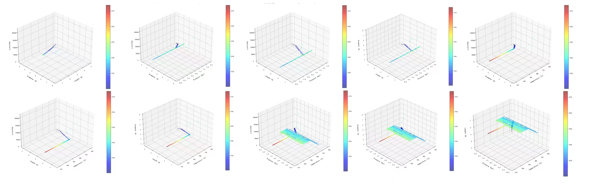
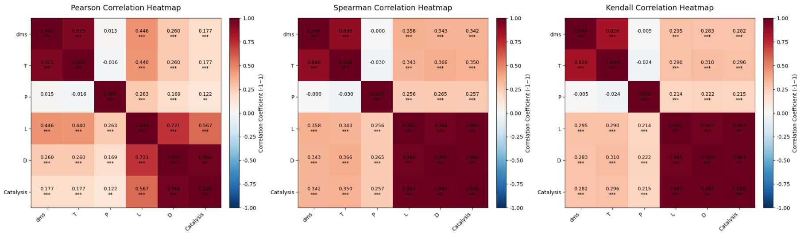

  <h1 align="center">Deep-DMS-Reactor</h1>

  <p align="center">Yuze Hao, Kai Hou, Xiang Li, Rui-Rui Shi, Lan Duo and Changyan Li</p>

  <p align="center">College of Chemistry and Chemical Engineering, Inner Mongolia University, Hohhot 010021, China.</p>


  <p align="center">celicy(at)imu(dot)edu(dot)com</p>

  <p align="center">Interpretability Deep learning model for optimizing a tubular plug flow reactor in the methanol-hydrogen sulfide to DMS process.</p>

---

# Table of contents

- [Introduction](#Introduction)
- [Reaction Process Construction](#Reaction-Process-Construction)
- [Automated Simulation](#Automated-Simulation)
- [Benchmark](#Benchmark)
- [Deep Leaning Model Training](#Deep-Leaning-Model-Training)
- [Model Interpretability](#Model-Interpretability)
- [Model Inference](#Model-Inference)
- [Reactor Optimization result](#Reactor-Optimization-result)
- [Citation](#Citation)
- [Fast Start](#Fast-Start)
- [License](#License)


# Introduction

To address the issues in the traditional parameter optimization of tubular fixed-bed reactors for dimethyl sulfide (DMS) synthesis—including the difficulty in quantifying multi-parameter interactions, the "black-box" nature of model predictions, and the high cost of experiments/simulations—an explainable deep learning model is adopted to achieve global optimization of the reactor's key operating parameters, aiming to maximize the DMS mass flow rate and quantify the influence weight of each parameter on reaction performance.


<p align = "center">Reaction Process<p>

<div align="right">
    <b><a href="#Table-of-contents">↥ back to top</a></b>
</div>

# Reaction Process Construction

We use ASPEN PLUS V12 software to construct Chemical Engineering Process.


<div align="right">
    <b><a href="#Table-of-contents">↥ back to top</a></b>
</div>

# Automated Simulation

For Automated Simulation, we build [pyaspenplus](https://github.com/YuzeHao2023/pyaspenplus) to accelating simulation.

<div align="right">
    <b><a href="#Table-of-contents">↥ back to top</a></b>
</div>

# Benchmark

We use pyaspenplus to automation simulated 482 results as a benchmark, labeling as Mass flow rate of DMS in the outlet stream.





<div align="right">
    <b><a href="#Table-of-contents">↥ back to top</a></b>
</div>

# Deep Leaning Model Training

We have trained about 11 Machine Learning Model and select TabPFN Model to Interpretable data.

Model reslts is listed below:

| Model               | R-Square Value  | RMSE Value                   |
|---------------------|-----------------|------------------------------|
| TabPFN Transformer  | 0.9249          | 1.793                        |
| Random Forest       | 0.9200          | 2.135                        |
| KNN                 | 0.9070          | 2.303                        |
| GradientBoosting    | 0.8930          | 2.477                        |
| GBM                 | 0.8840          | 2.577                        |
| ElasticNet          | 0.8560          | 2.867                        |
| PLSRegression       | 0.8490          | 2.938                        |
| SVM                 | 0.8300          | 3.177                        |
| Decision Tree       | 0.8150          | 3.247                        |
| Linear Regression   | 0.7680          | 3.713                        |
| Neural Network      | -3784.3676      | 3740.327                     |


<p align = "center">TabPFN Training figure<p>

<div align="right">
    <b><a href="#Table-of-contents">↥ back to top</a></b>
</div>

# Model Interpretability


<div align="right">
    <b><a href="#Table-of-contents">↥ back to top</a></b>
</div>

# Model Inference


<div align="right">
    <b><a href="#Table-of-contents">↥ back to top</a></b>
</div>

# Reactor Optimization result

TABLE 2 Final Reactor Design Specifications
| Project               | Details                          |
| --------------------- | -------------------------------- |
| Equipment Name        | Methanol-Hydrogen Sulfide Reactor|
| Reactor Type          | Tubular Fixed-Bed Reactor        |
| Shell Inner Diameter  | 2200 mm                          |
| Overall Height        | 8106 mm                          |
| Tube Count            | 1114                             |
| Tube Length           | 4000 mm                          |
| Heat Transfer Area    | 1889.86 m²                       |
| Shell Material        | 15CrMoR                          |
| Shell Wall Thickness  | 16 mm                            |
| Head Wall Thickness   | 16 mm                            |
| Skirt Wall Thickness  | 20 mm                            |
| Catalyst Bed Height   | 2200 mm                          |

<div align="right">
    <b><a href="#Table-of-contents">↥ back to top</a></b>
</div>

# Citation

This paper is under-review, the whole citation information will update after publishing.

If this paper is helpful for you, please cite:

```bib
@misc{hao2025deepdms,
      title={Deep-DMS_Reactor}, 
      author={Yuze Hao, Kai Hou, Rui-Rui Shi, Xiang Li, Lan Duo and Changyan Li},
      year={2025},
      publisher = {GitHub},
      journal = {GitHub repository},
      howpublished = {\url{https://github.com/YuzeHao2023/Deep-DMS-Reactor}},
}
```

<div align="right">
    <b><a href="#Table-of-contents">↥ back to top</a></b>
</div>

# Fast Start

repo structure is:

```
├── README.md
├── asserts
│   ├── Inference
│   │   └── inference.jpg
│   ├── Interpretability
│   │   └── interpretaable.png
│   ├── benchmark
│   │   ├── benchmark.jpg
│   │   └── heatmap.png
│   ├── intro
│   │   ├── DMSreactor.svg
│   │   └── outputs_3d
│   │       ├── 3D_CH3SH.html
│   │       ├── 3D_HO-M-O_bridged.html
│   │       ├── 3D_Intermediate_S-bound.html
│   │       ├── 3D_Product_CH32S.html
│   │       └── 3D_Product_H2S.html
│   ├── logo-deepdms.png
│   ├── process
│   │   └── process.png
│   └── training
│       └── ttraining.png
├── data
│   ├── Inference-data.csv
│   └── train-data.csv
├── requirements.txt
└── src
    ├── auto-train.r
    ├── global-step.py
    ├── inference.py
    └── model-train.py
```

First, fork this repo to your own profile, and run the following code on your local terminal:

```bash
git clone https://github.com/your-forked-repo-URL/Deep-DMS-Reactor.git
cd Deep-DMS-Reactor
```

```bash
pip3 install -r requirements.txt
```

and run model-train code:

```bash
python3 src/model-train.py
```

run global optimizing:

```bash
python3 src/global-step.py
```

and change the upload code:

```python
data = pd.read_csv(r"train-data.csv", encoding='ISO-8859-1')
```

```bash
python3 src/inference.py
```


<div align="right">
    <b><a href="#Table-of-contents">↥ back to top</a></b>
</div>

# License

All rights reserves.

<div align="right">
    <b><a href="#Table-of-contents">↥ back to top</a></b>
</div>
